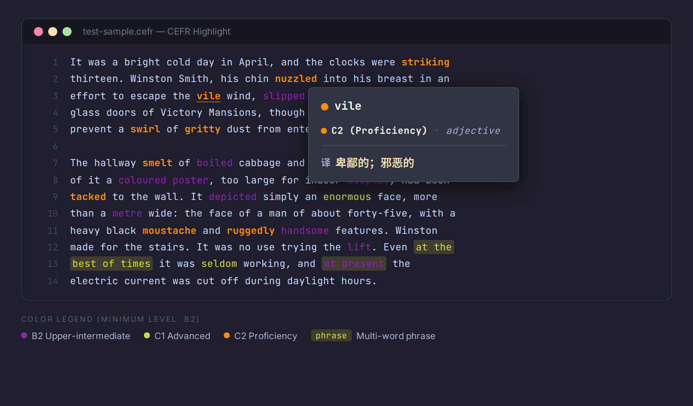

# CEFR Highlight

A VSCode/Cursor extension that highlights English vocabulary by CEFR level (A1–C2) using semantic tokens. Hover over any word to see its level, part of speech, and Chinese translation.

## Features

- **Semantic highlighting** — words are colored by CEFR level in `.cefr` files
- **Phrase detection** — multi-word phrases are recognized with higher priority than individual words and given a background highlight
- **Hover tooltips** — hover over a word or phrase to see its CEFR level, part of speech, and Chinese translation (via Google Translate)
- **Configurable** — customize colors, minimum level threshold, and phrase background



## Color Legend

| Level | Default Color | Emoji | Description |
|-------|--------------|-------|-------------|
| A1 | `#BDBDBD` Grey | ⚪ | Beginner |
| A2 | `#43A047` Green | 🟢 | Elementary |
| B1 | `#1E88E5` Blue | 🔵 | Intermediate |
| B2 | `#8E24AA` Purple | 🟣 | Upper-intermediate |
| C1 | `#CDDC39` Lime | 🟡 | Advanced |
| C2 | `#FB8C00` Orange | 🟠 | Proficiency |

By default, only words at **B2 and above** are highlighted.

## Configuration

All settings live under `cefrHighlight.*` in your VSCode/Cursor settings:

| Setting | Default | Description |
|---------|---------|-------------|
| `cefrHighlight.minimumLevel` | `B2` | Only highlight words at or above this level |
| `cefrHighlight.colors.A1` | `#BDBDBD` | Foreground color for A1 words |
| `cefrHighlight.colors.A2` | `#43A047` | Foreground color for A2 words |
| `cefrHighlight.colors.B1` | `#1E88E5` | Foreground color for B1 words |
| `cefrHighlight.colors.B2` | `#8E24AA` | Foreground color for B2 words |
| `cefrHighlight.colors.C1` | `#CDDC39` | Foreground color for C1 words |
| `cefrHighlight.colors.C2` | `#FB8C00` | Foreground color for C2 words |
| `cefrHighlight.phraseBackground` | `rgba(255, 235, 59, 0.15)` | Background color for multi-word phrases |

Example — show only C1+ words:

```json
{
  "cefrHighlight.minimumLevel": "C1"
}
```

## Vocabulary Data

The CEFR index contains **~72,800 words** and **~3,000 phrases**, merged from four sources (in priority order):

1. **CEFR-J Vocabulary Profile** — 7,020 manually curated entries by language researchers
2. **EFLLex** — 13,843 frequency-graded lemmas from the UCLouvain graded reader corpus
3. **Oxford 14K** — 10,618 words classified via ML on Oxford 5000 features
4. **Maximax67 Words-CEFR-Dataset** — 62,238 entries computed from Google N-Gram frequencies, filtered to remove obscure words

## Architecture

```
cefr-highlight/
├── server/          Rust language server (tower-lsp)
│   ├── src/
│   │   ├── main.rs       LSP lifecycle, semantic tokens, hover + translation
│   │   ├── cefr.rs       CEFR index loading, lookup with inflection handling
│   │   ├── tokenizer.rs  Word/phrase tokenization with longest-match priority
│   │   └── translate.rs  Google Translate free API client with in-memory cache
│   └── data/
│       └── cefr_index.json   Vocabulary database (embedded at compile time)
├── client/          TypeScript extension client
│   └── src/
│       └── extension.ts  Language client, color sync, phrase decorations
└── package.json     Extension manifest and configuration schema
```

- **Server** (Rust / tower-lsp): loads the CEFR dictionary at startup, tokenizes documents, returns semantic tokens and hover info via LSP, fetches Chinese translations on demand
- **Client** (TypeScript / vscode-languageclient): spawns the server binary over stdio, syncs color configuration to editor semantic token rules, applies phrase background decorations via a custom `cefr/phraseRanges` notification

## Building

```bash
# Build the language server
cd server && cargo build --release

# Build the extension client
cd client && npm install && npm run compile
```

## Installation

After building, symlink the project into your extensions directory:

```bash
ln -s /path/to/cefr-highlight ~/.cursor-server/extensions/kamome.cefr-highlight-0.3.0
```

Then reload the window (**Ctrl+Shift+P** → **Developer: Reload Window**).

## Usage

1. Create or open a file with the `.cefr` extension
2. Words at or above the configured minimum CEFR level will be highlighted
3. Hover over any highlighted word to see its level, part of speech, and Chinese translation

## Development

Press **F5** in VSCode/Cursor to launch the Extension Development Host.

## License

MIT
